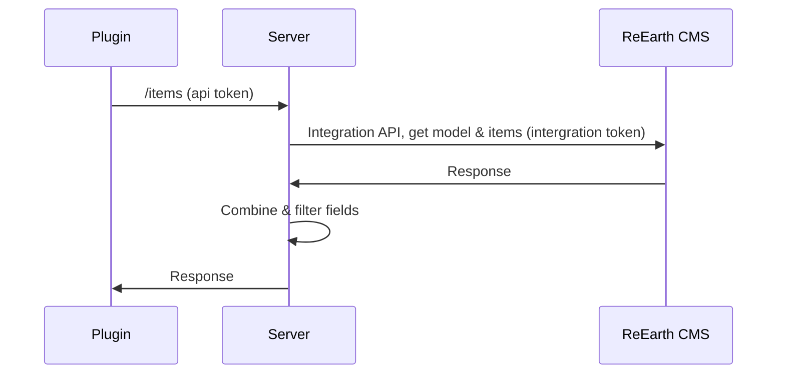
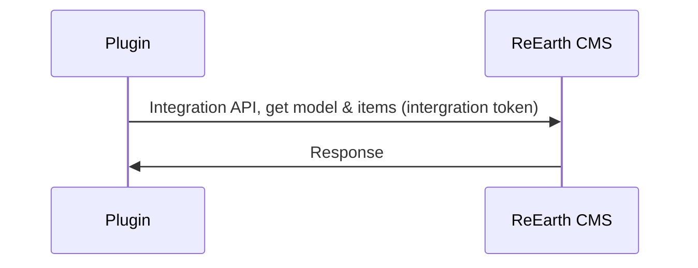

# CMS Data Visualizer Plugin

A Re-Earth Visualizer plugin that enables visualization of CMS data on 3D maps with customizable markers and information displays.

## Features

- **Multiple Data Sources**: Support for CMS Data Visualizer Server and CMS Integration API
- **Flexible Location Data**: Handle longitude/latitude fields, coordinate arrays, or GeoJSON
- **Customizable Visualization**: Configurable marker appearance and infobox fields
- **Inspector Block**: Dedicated component for detailed data inspection

## Quick Start

### Prerequisites

- Node.js >= 20.11.0
- Yarn 4.5.1

### Installation

```bash
# Clone the repository
git clone <repository-url>
cd cms-data-visualizer-plugin

# Install dependencies
yarn install
```

### Development

```bash
# Start development server with hot reload
yarn dev-build

# Or start specific components
yarn dev:visualizer:main        # Main visualizer UI
yarn dev:inspector_block:main   # Inspector block UI
```

### Building

```bash
# Build production version and create zip
yarn build

# Build specific components
yarn build:visualizer           # Main visualizer
yarn build:inspector_block      # Inspector block
```

### Preview

```bash
# Preview built app
yarn preview
```

## Configuration

The plugin supports two data source types:

### CMS Data Visualizer Server



- **Server Base URL**: Base URL of your CMS Data Visualizer server
- **Server API Key**: Authentication key for server access

### CMS Integration API



- **Integration API Base URL**: Base URL of your CMS Integration API
- **Integration API Key**: Authentication key for API access
- **CMS Project ID**: ID of the CMS project
- **CMS Model ID**: ID of the CMS model to visualize
- **Filters**: Optional value filters to limit displayed data

### Location Data Types

1. **Longitude & Latitude Fields**: Separate fields for coordinates
2. **Longitude & Latitude Array Field**: Single field containing coordinate array
3. **GeoJSON Field**: Field containing GeoJSON geometry data

### Data Filtering

The plugin supports filtering CMS data when using the Integration API:

- **Filter Format**: `field===value|value2;field2===value3`
- **Multiple Values**: Use pipe `|` to separate multiple values for the same field
- **Multiple Fields**: Use semicolon `;` to separate different field filters
- **Example**: `status===published|reviewed;category===news`

This example will show only items where:
- `status` field equals "published" OR "reviewed"
- AND `category` field equals "news"

### Customization

- **Display Fields**: Comma-separated list of fields to display in inspector block
- **Marker Appearance**: JSON configuration for marker styling

## Architecture

This plugin follows the Re-Earth extension-ui architecture:

- **Extensions** (`src/extensions/`): Core plugin logic interfacing with Re-Earth API
- **UI Components**: React-based user interfaces built with ShadCN/UI
- **Shared Components**: Reusable UI components and utilities

### Tech Stack

- React 19.1.0 with TypeScript 5.7.2
- Vite 6.0.3 for build tooling
- TailwindCSS 4.1.10 for styling
- Radix UI components with ShadCN/UI
- Re-Earth Core 0.0.7-alpha.38

## Scripts

### Development

- `yarn dev-build` - Concurrent development with preview server
- `yarn manage` - Interactive extension/UI management

### Code Quality

- `yarn lint` - Run ESLint
- `yarn fix` - Auto-fix ESLint issues
- `yarn format` - Format code with Prettier

### Production

- `yarn build` - Build and create distributable zip
- `yarn preview` - Preview production build

## Extension Management

Use the interactive management script:

```bash
yarn manage
```

This allows you to:

- Create new extensions with UI components
- Add UI components to existing extensions
- Remove extensions or individual UI components
- Automatically update configuration files

## Development Conventions

- Use fixed dependency versions (no ^ or ~ prefixes)
- Follow existing code patterns and conventions
- Keep commit messages brief and on one line

## License

[License information]
